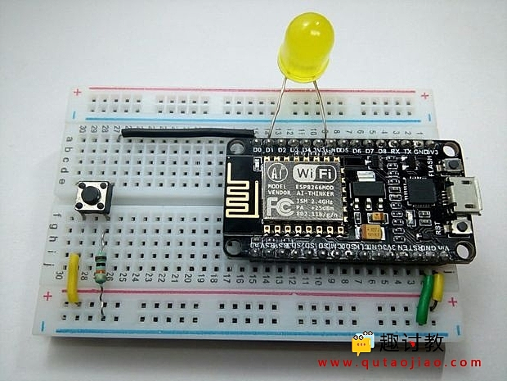

### 1. led 闪烁
```c++
  /*
  ESP8266 Blink by Simon Peter
  Blink the blue LED on the ESP-01 module
  This example code is in the public domain

  The blue LED on the ESP-01 module is connected to GPIO1
  (which is also the TXD pin; so we cannot use Serial.print() at the same time)

  Note that this sketch uses LED_BUILTIN to find the pin with the internal LED
*/

void setup() {
  pinMode(LED_BUILTIN, OUTPUT);     // Initialize the LED_BUILTIN pin as an output
}

// the loop function runs over and over again forever
void loop() {
  digitalWrite(LED_BUILTIN, LOW);   // Turn the LED on (Note that LOW is the voltage level
  // but actually the LED is on; this is because
  // it is active low on the ESP-01)
  delay(1000);                      // Wait for a second
  digitalWrite(LED_BUILTIN, HIGH);  // Turn the LED off by making the voltage HIGH
  delay(2000);                      // Wait for two seconds (to demonstrate the active low LED)
}
```

### 2. 伺服电机 
- [MG996R的详细参数文档](https://pdf1.alldatasheet.com/datasheet-pdf/view/1131873/ETC2/MG996R.html)
- [接外部电源](https://blog.csdn.net/LUqingyaun/article/details/88600573)
-  [接nodemcu电源](https://github.com/C1499/MiKa/blob/master/esp8266/README.md)
-  2023 淘宝价格 11元, 除去邮费假设为(6元), 这个东西的价格应该在5元左右, 成本价估计也就 3元左右.
```
Specifications 
•Weight: 55 g 
•Dimension: 40.7 x 19.7 x 42.9 mm approx. 
•Stall torque: 9.4 kgf·cm (4.8 V ), 11 kgf·cm (6 V) 
•Operating speed: 0.17 s/60º (4.8 V), 0.14 s/60º (6 V)  
•Operating voltage: 4.8 V a 7.2 V
•Running Current 500 mA –
•Stall Current 2.5 A (6V) 
•Dead band width: 5 μs 
•Stable and shock proof  double ball bearing design
•Temperature range: 0 ºC –4.8 V a 7.2 V– 900 mA (6V) double ball bearing design55 ºC
```

```c++
  /* Sweep
  by BARRAGAN <http://barraganstudio.com>
  This example code is in the public domain.

  modified 28 May 2015
  by Michael C. Miller
  modified 8 Nov 2013
  by Scott Fitzgerald

  http://arduino.cc/en/Tutorial/Sweep
*/

#include <Servo.h>

Servo myservo;  // create servo object to control a servo
// twelve servo objects can be created on most boards


void setup() {
  myservo.attach(2);  // attaches the servo on GIO2 to the servo object
}

void loop() {
  int pos;

  for (pos = 0; pos <= 180; pos += 1) { // goes from 0 degrees to 180 degrees
    // in steps of 1 degree
    myservo.write(pos);              // tell servo to go to position in variable 'pos'
    delay(15);                       // waits 15ms for the servo to reach the position
  }
  for (pos = 180; pos >= 0; pos -= 1) { // goes from 180 degrees to 0 degrees
    myservo.write(pos);              // tell servo to go to position in variable 'pos'
    delay(15);                       // waits 15ms for the servo to reach the position
  }
}

```

### 3. 轻触开关 [参考](https://www.qutaojiao.com/229.html)

```c++
int led = 5;   // LED引脚 //D1
int button = 16; // 按键连接的引脚 // D0
int temp = 0;    // 用于读取按键状态的临时变量
void setup() {
  pinMode(led, OUTPUT);   // LED设置为输出
  pinMode(button, INPUT); // 按键设置为输入, 实际上就是个信号参考位，不影响其它引脚。仅仅是一个内存标志。
}
void loop() {
  temp = digitalRead(button);
  if (temp == HIGH) {
    digitalWrite(led, HIGH);
    Serial.println("LED Turned ON");
    delay(1000);
  }
  else {
    digitalWrite(led, LOW);
    Serial.println("LED Turned OFF");
    delay(1000);
  }
}
```

### 4. [Nodemcu 控制 L298N 驱动电机](https://blog.csdn.net/qq_44419932/article/details/115905686)

### 5. [小爱同学语音通过点灯科技控制nodemcu led](https://www.kidscoding8.com/118686.html)

### 6. [nodemcu 通过红外控制空调](https://www.yiboard.com/thread-1544-1-1.html)

### 7. [nodemcu 控制DHT11](https://blog.51cto.com/u_15440897/4672869)

### 8. [nodemcu 控制4个 5V的继电器 VIN 输入5V](https://www.elecfans.com/d/1856924.html)

## 附带资料:
### 1. [EMQ 的MQTT客户端,可以用来调试mqtt](https://www.emqx.com/en/blog/esp8266-connects-to-the-public-mqtt-broker)
### 2. [小程序接科大讯飞语音识别](https://developers.weixin.qq.com/community/develop/article/doc/000ac6470783008cc7fd577525bc13)
### 3. [小程序接腾讯云语音识别](https://blog.csdn.net/m0_46846526/article/details/123719767)
### 4. [小程序接百度云语音识别](https://blog.csdn.net/sdfjasad/article/details/114148713)
