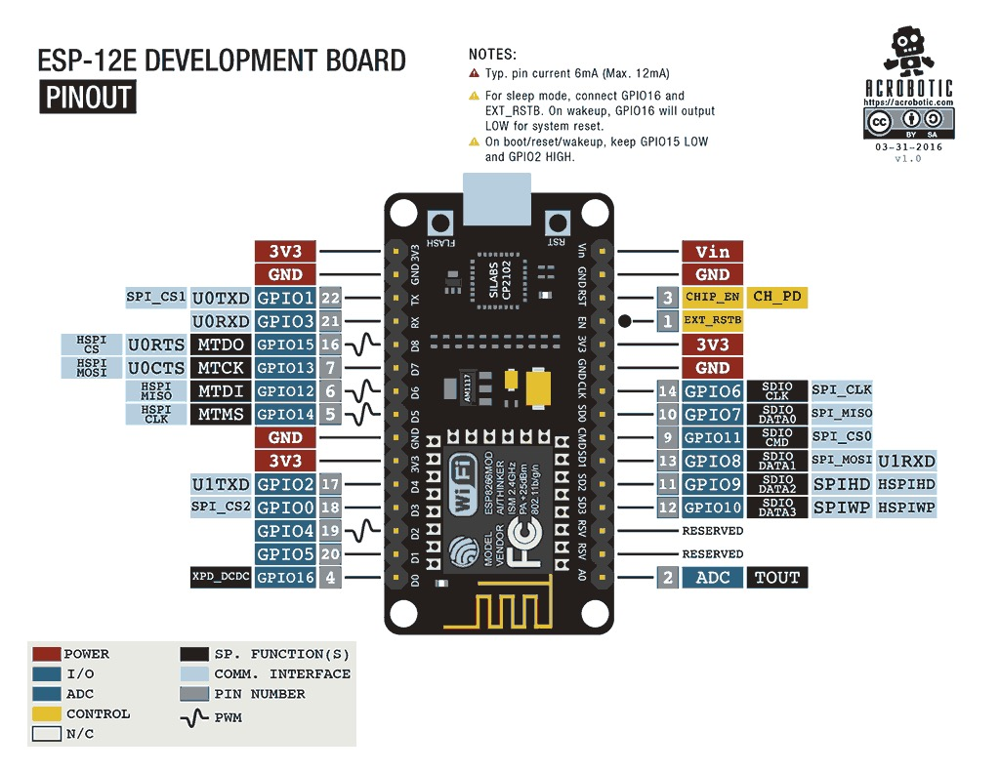

### [ch340 mac 版驱动](https://github.com/adrianmihalko/ch340g-ch34g-ch34x-mac-os-x-driver/raw/master/CH34x_Install_V1.5.pkg) 
是一种类似USB的串口，但是普通USB 口是供电口，不能识别为通信口，所以要安装驱动. 340的驱动比2102的驱动的nodemcu大一点，不能插面包板

### arduino -> preference -> settings -> additional boards manager urls (nodemcu 插件) 
``` http://arduino.esp8266.com/stable/package_esp8266com_index.json ```
### tools => board arduino -> board manager -> 搜索 esp8266 选择 esp8266 byesp8266 community 安装

### tools => 将开发板选择为 nodemcu 1.0 esp 12e module
### 将nodemcu 插到电脑上， tools 中选择这个新出现的 com 口

## [注意 nodemcu 引脚名 和 esp8266 引脚的对应](http://www.taichi-maker.com/homepage/esp8266-nodemcu-iot/esp8266-nodemcu-tutorial-index/nodemcu-board/) 

1. digitalWrite(Pin,1); 这里的Pin对应的数字是GIPO后面的数字!!!
2. GPIO 6- 11 跟闪存相关不建议使用!!
3. ```GPIO 4,GPIO5 对应nodemcu 的D2 和 D1```
4. led 可以直接接GPIO引脚和GND，不会烧坏。
# [特别注意esp 12f 说明书含有GPIO图示](https://docs.ai-thinker.com/_media/esp8266/docs/esp-12f_product_specification_zh_v1.0.pdf)
### nodemcu 的工作电压不要超过3.6V,一般在3.3V。引脚的最大工作电压为1V,最大工作电流为12mA(0.012A)
### 注意：如果是LED测试，千万不要直接用nodemcu 的3.3v 直接接LED 然后接GND,那样就直接烧了LED,需要串联一个3.3k-10k的电阻。
### 一段测试板子是否正常的代码(也可以用arduino -> file -> example -> basics -> blink，编译烧写 来查看是否nodemcu 正常工作）
### 上传代码到nodemcu,稍等片刻,大概10秒钟。对应的wifi必须存在才会打印信息。
总结一下：
### 1. 默认上面的写法是STA模式，相当于芯片去连接 wifi AP(路由器，或者热点）
### 2. arduino 是先编译,再upload,upload 会先连接esp,如果连接失败,除了参数设置问题,一般就是电路和esp有问题.按烧写器prog/flash 才能刷入.
### 3. Serial.begin(115200); 设置的baud 一定要和 serial monitor 上的 一样才不会出现乱码
### 4. 手机开热点可以不用接互联网网口wifi 或 移动流量也可以连芯片，它们是互不干扰的。
### 5. arduino 里面的String s = "xxx" 和 char *c = "xxx" char [] ssid = "xx" 不可以随便等同，String 是一个c++ 类
### 6. udp 模块读的API 可以是int, char[], String,但发送只能string, char[]

### 给esp 12f 编程：[这里提供了三种方法](https://www.youtube.com/watch?v=_iX67plFeLs&t=99s) , 我个人认为都不是很方便，还这么麻烦还是买一个烧写架 40元左右得了，可插拔的那种,不过驱动一般是 CH9102。
