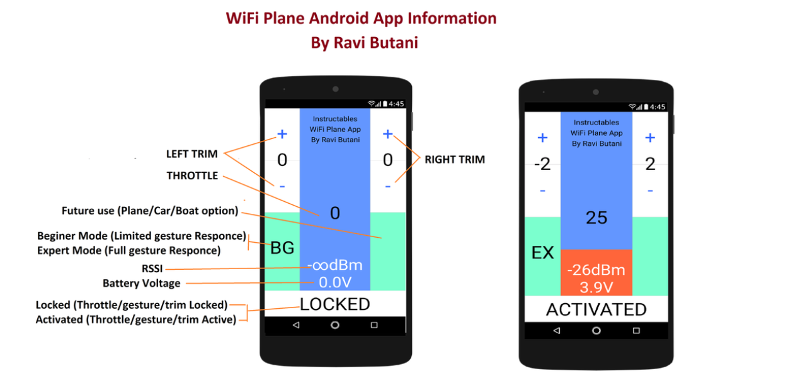

### 参考文章的作者采用的是 process language 来编写 上位机,没VPN配置很麻烦. 

### 下面是作者的代码:

```java
//**************************************************
// WiFi Controlled Tiny Airplane
// Android App Processing file
// By Ravi Butani
// Rajkot INDIA
// Instructables page:https://www.instructables.com/id/WIFI-CONTROLLED-RC-PLANE/
//***************************************************

import hypermedia.net.*; // import UDP library
import ketai.sensors.*;  // import Ketai Sensor library
import ketai.ui.*;

int app_start=1;
int DC_UPDATE = 1;//old 3 gives flickring on plane
byte P_ID = 1;
int dc_count = 0;
int lock = 0;
int gas = 0;
int rssi=0;
int vcc=0;
int l_speed = 0;
int r_speed = 0;
int vib_count = 0;
int rst_count = 0;
UDP udp;             // define the UDP object
KetaiSensor sensor;  // define the Ketai sensor object
KetaiVibrate vibe;
float accelerometerX, accelerometerY, accelerometerZ;
int exprt_flag = 0;
float diff_power = 2.2;
int remotPort = 6000;
int localPort = 2390;
int offsetl = 0;
int offsetr = 0;
String remotIp = "192.168.43.255";  // the remote IP address

void setup()
{
  // 显示区域大小
  size(displayWidth,displayHeight);
  // 竖直方向
  orientation(PORTRAIT);
  // 初始化UDP,监听本地接口
  udp = new UDP( this, localPort );
  udp.listen( true );
  // 初始化加速计对象
  sensor = new KetaiSensor(this);
  // 初始化震动马达对象
  vibe = new KetaiVibrate(this);
  sensor.start();
}

void draw()
{
  // 绿色背景
  background(125, 255, 200);
  fill(255);
  stroke(163);
  rect(0,0,width/4,height/4);
  rect(3*width/4,0,width/4,height/4);
  rect(0,height/4,width/4,height/4);
  rect(3*width/4,height/4,width/4,height/4);

  // locked / activated
  rect(0,7*height/8,width,height/8);
  
  // 油门橘红色背景
  fill(color(255,100,60));
  rect(width/4,0,width/2,7*height/8);

// 中间蓝色部分矩形
  fill(color(100,150,255));
  // ===== 7*height/8   *   (1 - gas / 127) // 提取后的公式
  rect(width/4, 0, width/2, ((7*height)/8)-(gas*7*height)/(8*127) );

  // 左右微调
  textSize(height/12);
  textAlign(CENTER,CENTER);
  fill(color(50,100,255));
  // left trim
  text("+", width/8, height/8 - 10);
  text("-", width/8, 3*height/8 - 10);
  // right trim
  text("+", 3*width/4 + width/8, height/8 - 10);
  text("-", 3*width/4 + width/8, 3*height/8 - 10);
  fill(0);

  // ====== 中心展示 油门大小 (gas / 127) * 100 
  text(gas * 100/127, width/2, height/2);

  // left trim 值
  text(offsetl, width/8, height/4 - 10);
  // right trim 值
  text(offsetr, 3*width/4 + width/8, height/4 -10);


  // 初级模式和专家模式,后者用加速计操控
  if(exprt_flag == 0){text("BG", width/8, height/2 + height/6);}
  else if(exprt_flag == 1){text("EX", width/8, height/2 + height/6);}


  // 关闭或激活遥控
  if(lock == 0)text("LOCKED", width/2, 7*height/8 + height/16);
  else if(lock == 1)text("ACTIVATED", width/2, 7*height/8 + height/16);
  textSize(height/14);
  fill(255);

  // 信号强度显示
  // ======= rssi 为0 显示无穷大符号
  if (rssi == 0 )text("-"+Character.toString('\u221e')+"dBm", width/2, 3*height/4);
  else text("-"+rssi+"dBm", width/2, 3*height/4);
   
  // ======= 电压显示
  text((vcc/10)+"."+(vcc%10)+"V", width/2, 3*height/4 + height/12);
  fill(0);
  
  // 作者简介
  textSize(height/30);
  textAlign(CENTER,CENTER);
  text("Instructables", width/2, height/20);
  text("WiFi Plane App", width/2, 2*height/20);
  text("By Ravi Butani", width/2, 3*height/20);
  textSize(height/12);
  
   delay(1);
   dc_count++;

   if(dc_count >= DC_UPDATE)// 1
  {
    rst_count++;
    if(rst_count >= 200)
    {
      vcc = 0;
      rssi = 0;
    }
    dc_count = 0;

    // 保证x 轴浮动在 -1.5 - 1.5
    if(accelerometerX > 1.5){accelerometerX = accelerometerX - 1.5;}
    else if(accelerometerX < -1.5){accelerometerX = accelerometerX + 1.5;}
    else {accelerometerX = 0;}

    // 能量偏移单元 2.2
    // 左电机速度 = 油门值 + 左trim + x 轴坐标 * 能量偏移单元
    l_speed = (int)((float)gas + (float)offsetl + accelerometerX*(float)diff_power);
    r_speed = (int)((float)gas + (float)offsetr - accelerometerX*(float)diff_power);

    // 控制电机速度值在 1 - 127 内
    if(l_speed >= 127 )l_speed = 127;
    else if(l_speed <= 1)l_speed = 1;

    if(r_speed >= 127 )r_speed = 127;
    else if(r_speed <= 1)r_speed = 1;

    byte message[]  = {'1','2','3'};  // the message to send

    message[0] = P_ID;// 1
    if(lock == 1){ // 激活态
      message[1] = (byte)l_speed;
      message[2] = (byte)r_speed;
      vib_count++;
      // 如果电压小于 35 且 震动次数小于 5 震动1秒,累计40次 重新震动
      if(vcc<35 && vib_count<5){vibe.vibrate(1000);}
      if(vib_count>=40)vib_count = 0;
    }
    else if(lock == 0){// ======= 锁定态 电机速度全部为0
      message[1] = (byte)0x01;
      message[2] = (byte)0x01;
    }
    println(message[1]);
    println(message[2]);
    String msg = new String(message);// udp 向芯片发送数据
    udp.send( msg, remotIp, remotPort );
    println("msgsend");
  }
   
}

// 加速器回调
void onAccelerometerEvent(float x, float y, float z)
{
  accelerometerX = x;
  accelerometerY = y;
  accelerometerZ = z;
}

void mouseDragged()
{
  // 手指在手机屏幕的中间油门区域移动 计算油门值 = 127 * (1 - Y 坐标 / 油门区域的高)
  if(mouseY<7*height/8 && mouseX>width/4 && mouseX<3*width/4 && lock==1)  gas = 127-(int)(((float)mouseY/((float)(7*height/8)))*(float)127);
}

void mousePressed()
{
  // 左右trim
  if(mouseX<width/4 && mouseY<height/4) offsetl++;

  else if(mouseX<width/4 && mouseY<height/2) offsetl--;

  else if(mouseX>3*width/4 && mouseY<height/4) offsetr++;

  else if(mouseX>3*width/4 && mouseY<height/2) offsetr--;

  else if(mouseX<width/4 && mouseY<3*height/4){ // 专家模式 能量偏移单元增加为3.9
    if(exprt_flag == 0){exprt_flag = 1; diff_power = 3.9;}
    else{exprt_flag = 0; diff_power = 2.2;}
  }
  else if(mouseY>7*height/8){// 锁定油门为0
    gas=0; 
    if (lock == 0)lock =1;
    else lock=0;
  }
}

void receive( byte[] data, String ip, int port ) {  // <-- extended handler
  rst_count=0;
  rssi = data[1]; // 接手芯片反馈的 信号强度 和 电压
  vcc  = data[2]+3;
}
```
