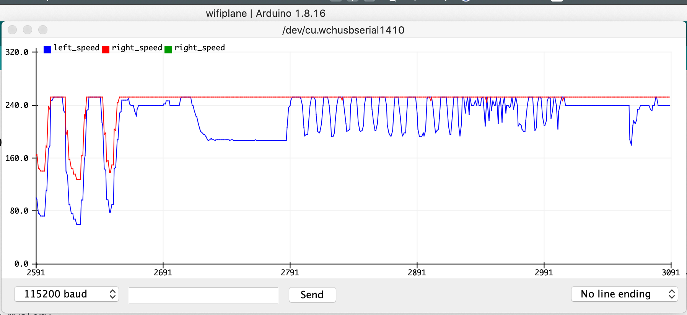
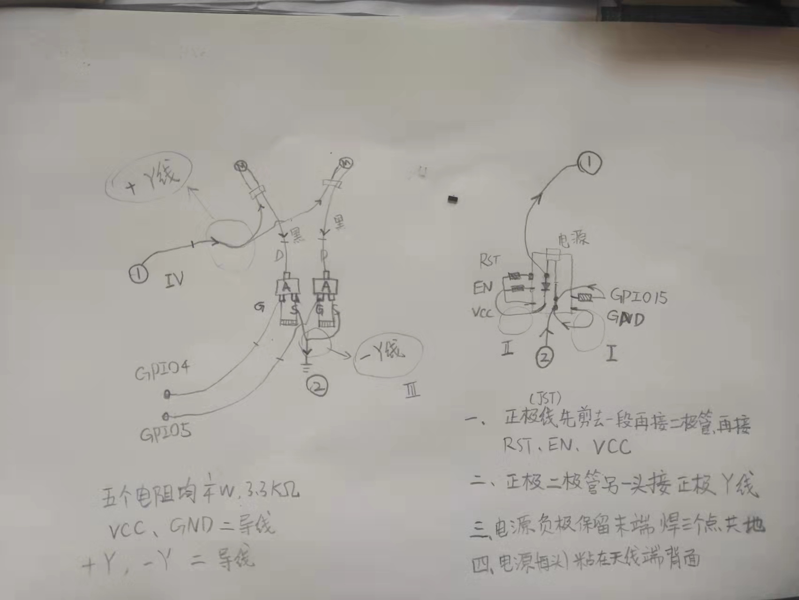
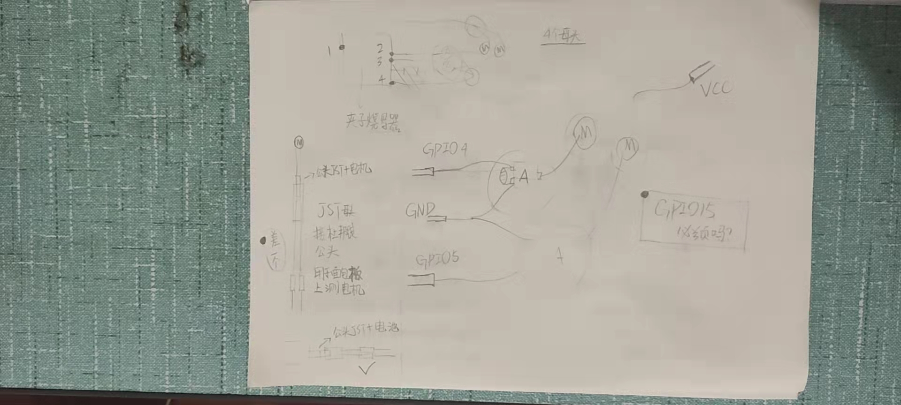
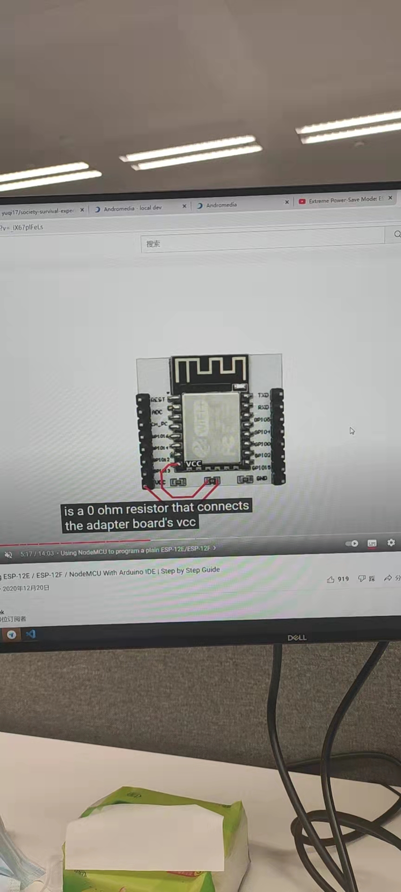
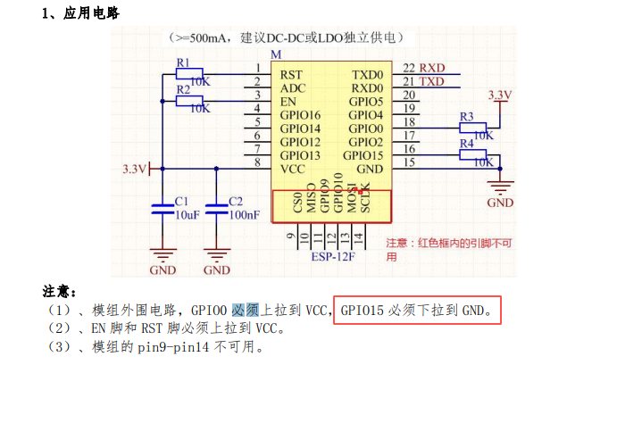

[直插LED 灯珠直径3mm,5mm的工作电压和电流](https://blog.csdn.net/congzheng8920/article/details/100452800) 3mm 绿色额定20mA,电压3-3.6V
## 工具：烙铁(去掉氧化层,或换新头保证挂锡)，高温海绵（需要浸水），烙铁架，焊锡丝，[松香](http://blog.sina.com.cn/s/blog_4fcd1ea30102z9ws.html)，镊子，剥线钳
### 1. 测试电池是否导电
```
  180mAH 20C 3.7V 的电池 最大电流3.6A, 用LED + 面包板 + 3.3k电阻；理论上电流是1mA.(led工作电压平均在15mA,电压2V)；
  实验结果：不亮；换电机亮，说明电池，电机，线路都是正常的。
```

### 2. 测试电机 : 电调 + 夹具烧写器 + 面包板 是否可用
```
  准备两根杜邦线母头的Y线,一根为阳线,一根为阴线.两根母头的信号线,接三极管和电阻组成的"电调",以及两个小马达;
```
### 3. 面包板知识
```
  面包板两端是正负极，红色正极，蓝色负极。注意线条中间短断开，表示线路也会断开，相应的下面是金属条。
  面包板两侧是可以拼接其它的面包板的，下面的双面胶可以用固定面包板。也可以去掉双面胶把面包板再拆成更小单元。
```

### 4. 测试上位机和下位机


## 正式焊接
1. 整体:


2. 测试草图:


3.适配板方案(洞洞板方案有很多不足故而弃用)
下面是适配板的部分电路,其中三个贴片电阻都是103->10k（10 * 10^3)的电阻(电容则是10 * 10^n pF),还有一部分线路被漆包住了.



4. 外围电路标准参考:

